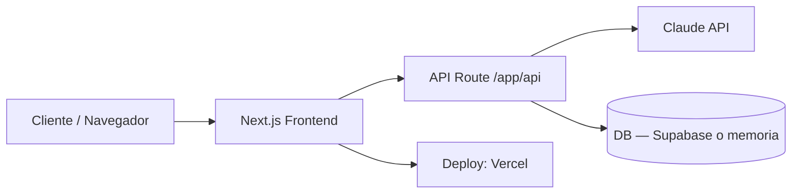

# Arquitectura

## Diagrama de alto nivel

## Explicación
El cliente interactúa con componentes de Next.js. Las acciones que requieren
IA o datos van a un route handler en /app/api, que llama a Claude API
server-side y opcionalmente persiste en la base de datos. Todo se despliega
como una sola app en Vercel.

<!-- completar en Sprint 0: módulos específicos del MVP, qué hace cada
endpoint, y actualizar el diagrama con los nombres reales de las features -->