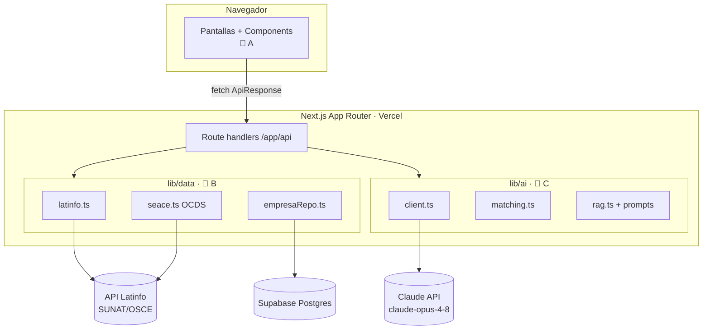

# Arquitectura

## Resumen
**Monolito modular contract-first** sobre Next.js 16 (App Router). Frontend y
backend viven en el mismo repo y despliegan como una sola app en Vercel. La
"costura" entre las 3 personas son los tipos compartidos (`lib/types`) + mocks
(`lib/mocks`): cada capa programa contra el contrato, no contra la implementación
del otro.

## Diagrama de alto nivel


## Flujo del MVP (3 pantallas)
1. **Onboarding** (`/onboarding`): RUC → `POST /api/empresa` (Latinfo autocompleta)
   → `POST /api/onboarding-chat` (3 preguntas, IA afina rubro) → guarda perfil.
2. **Dashboard** (`/dashboard`): `POST /api/match` → lista de `OportunidadCompatible`
   ordenada por % de compatibilidad. Simulador: cambiar rubro re-consulta.
3. **Ficha** (`/dashboard/oportunidad/[id]`): `POST /api/ficha/[id]` → RAG genera
   resumen ejecutivo + checklist accionable (`FichaRecomendacion`).

## Endpoints
| Ruta | Método | Dueño | Entrada → Salida |
|---|---|---|---|
| `/api/empresa` | POST | B | `{ruc}` → `Empresa` |
| `/api/licitaciones` | GET | B | `?rubro` → `Licitacion[]` |
| `/api/onboarding-chat` | POST | C | `{empresa, history}` → `OnboardingChatResponse` |
| `/api/match` | POST | C | `{empresa}` → `OportunidadCompatible[]` |
| `/api/ficha/[id]` | POST | C | `{empresa}` → `FichaRecomendacion` |

Todas devuelven el envelope `ApiResponse<T>` de `@/lib/types`.

## Decisiones (Sprint 0)
- **DB:** Supabase (Postgres). Solo persiste el perfil de empresa; las licitaciones
  se leen en vivo del SEACE. Sin pgvector: el RAG inyecta el JSON OCDS directo al
  contexto de Claude (suficiente para el MVP, menos riesgo en 12h).
- **IA:** SDK oficial `@anthropic-ai/sdk`, modelo `claude-opus-4-8`, structured
  outputs para garantizar JSON parseable. Solo server-side.
- **Resiliencia:** `lib/data` cae a `lib/mocks` si falta una credencial o un tercero
  falla → la demo no depende de servicios externos.
```
```
